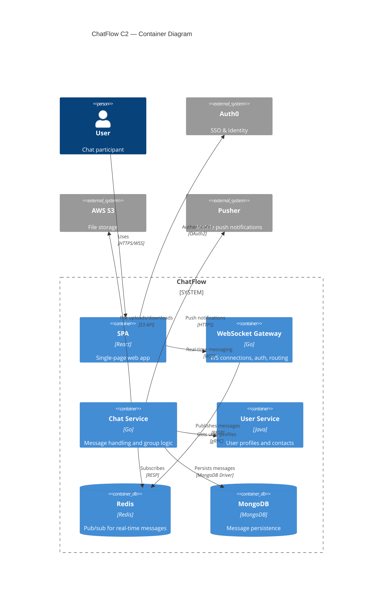
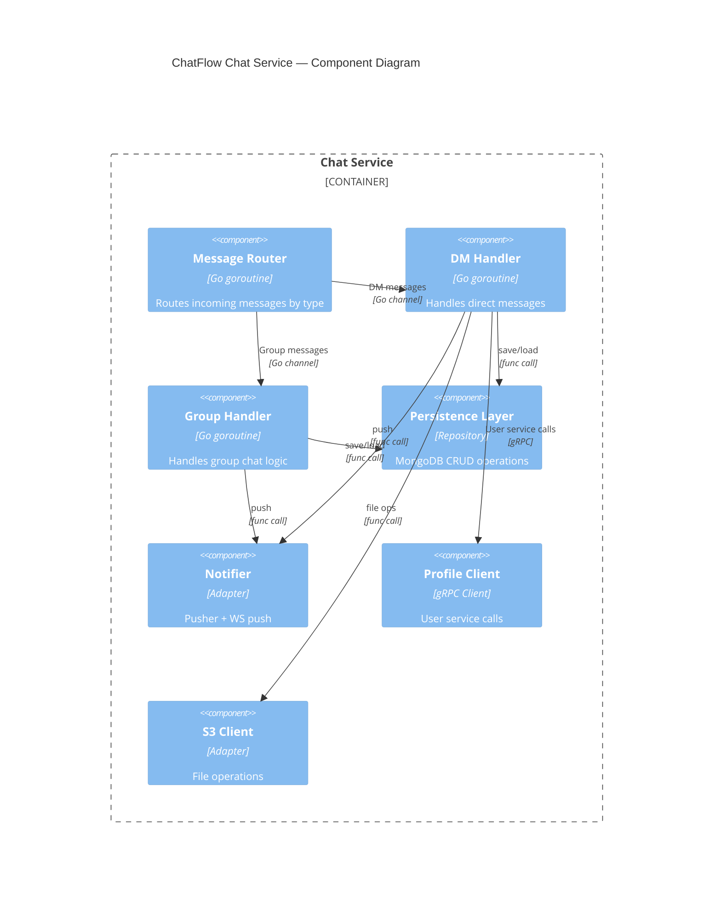
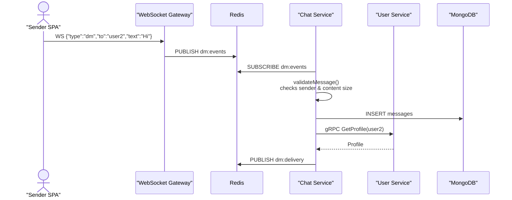
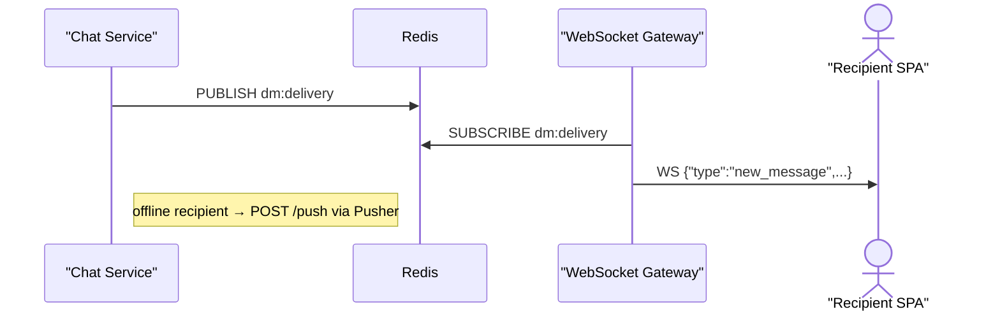
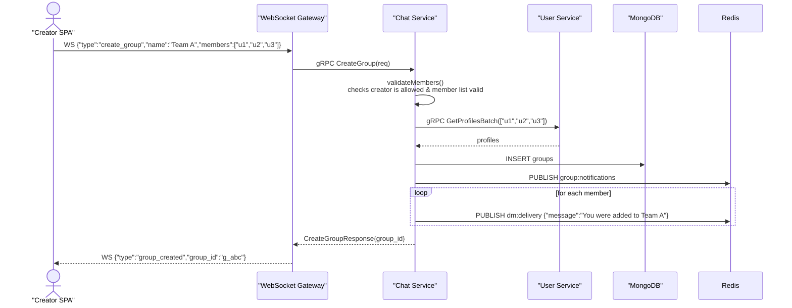
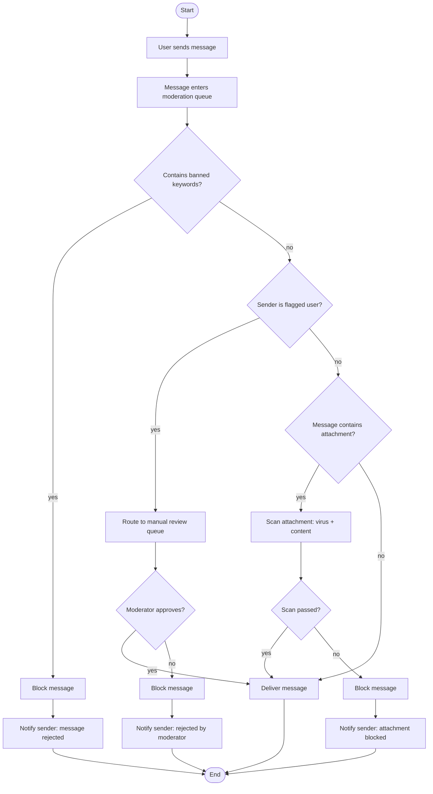

# Example: C4, Sequence, and Flowchart Diagrams Focus

**Scenario**: A user already has the business context documented and only needs help producing C4 topology diagrams, sequence diagrams, and flowcharts for a real-time chat platform called "ChatFlow". The user has strong opinions about the architecture and wants to iterate on the diagrams.

**Applies**: `draw-c4-topology` and `draw-interaction-diagrams` — demonstrates diagram-focused, iterative refinement workflow covering both sequence diagrams (for runtime message flows) and flowcharts (for process logic and decision branches).

---

## Input (User's Initial Prompt)

> We're building ChatFlow, a real-time messaging platform. Here's what we have: a React SPA frontend, a WebSocket gateway, a Chat service, a User service, and we use Redis for pub/sub and MongoDB for message persistence. External: we integrate with Auth0 for SSO and S3 for file uploads. Users send messages via the gateway, which publishes to Redis. The Chat service subscribes to Redis, persists to MongoDB, and pushes back to the recipient through the gateway. I need C2 and C3 diagrams, plus sequence diagrams for: (1) sending a direct message, (2) creating a group chat. Please produce these.

---

## Capability 2: draw-c4-topology

**Since the user provided detailed architecture, the assistant skips most discovery questions and goes straight to diagramming...**

**Q1**: Do the Chat service and User service communicate directly, or only through the WebSocket gateway?

*User answers: Direct — Chat service calls User service via gRPC to get user profiles.*

**Q2**: Any other external systems besides Auth0 and S3?

*User answers: We also use Pusher for push notifications to mobile.*

**C2 Container Diagram output**:

> **C2 takeaway**: SPA authenticates via Auth0 and holds a WebSocket to the Gateway; Chat Service consumes Redis pub/sub, persists to MongoDB, and calls User Service and Pusher.

[...user confirms...]

**C3 Component Diagram: Chat Service**:

> **C3 takeaway**: The Message Router fans out by message type to DM or Group Handler; both use the Persistence Layer and Notifier, and the DM Handler also calls the Profile and S3 clients.

---

## Capability 3: draw-interaction-diagrams

**Based on the diagram-selection-guide, the assistant determines:**
- **Send DM flow** → Sequence diagram (runtime message passing between participants)
- **Create group chat flow** → Sequence diagram (runtime message passing between participants)
- **Message moderation workflow** → Flowchart (decision logic with branching)

### Direct Message Flow (Sequence Diagrams)

**The flow has 8 participants, so it is split into two diagrams (intake + delivery) to stay within the 6-lifeline budget.**

**Send DM — intake & validation**:

**Send DM — delivery**:

> **DM takeaway**: Sender → Gateway → Redis `dm:events` → Chat Service validates/persists and publishes `dm:delivery`; offline recipients fall back to Pusher.

**Group Chat Creation Flow**:

> **Group creation takeaway**: Creator → Gateway → Chat Service validates, batch-fetches profiles, persists the group, notifies members, and returns the group_id.

### Message Moderation Workflow (Flowchart)

**The assistant recognizes this as decision logic with branching — a flowchart is the right choice.**

> **Moderation takeaway**: Messages pass keyword, flagged-user, and attachment scans; any rejection path notifies the sender.

