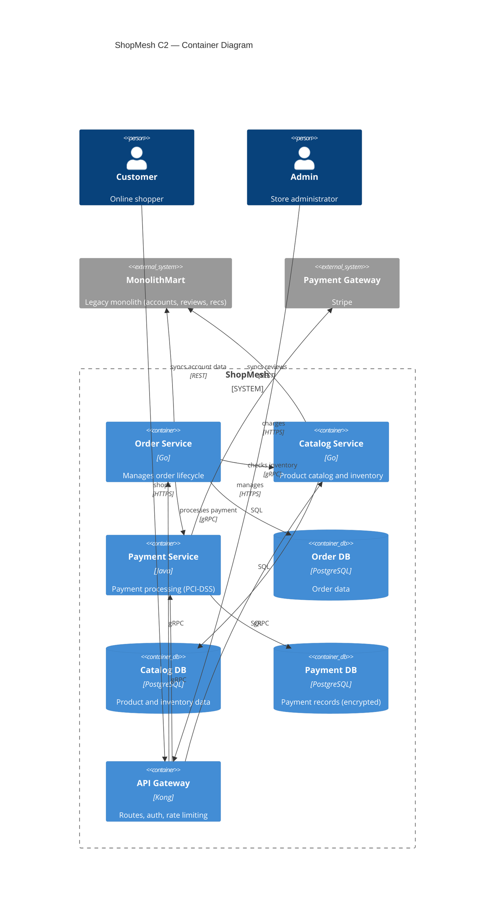

# Example: Full Solution Document Workflow

**Scenario**: A user has a finalized solution decision for migrating their monolithic e-commerce platform to a microservices architecture and wants a complete solution document covering all nine sections. The user starts from scratch with no pre-existing content.

**Applies**: `clarify-business-context`, `draw-c4-topology`, and `structure-solution-doc` in detail, with truncated output for the other capabilities — demonstrates the end-to-end sequencing pattern including both sequence diagrams and flowcharts where appropriate.

---

## Input (User's Initial Prompt)

> We've decided to migrate our legacy monolithic e-commerce platform (MonolithMart) to a microservices architecture. The new system is called "ShopMesh". We chose this because the monolith can't scale for our growing order volume (10x growth in 2 years), and different teams want to deploy independently. Key constraints: must be live before Black Friday (5 months), must comply with PCI-DSS for payments, and we can't have more than 30 minutes downtime during the migration. Can you help me write the solution document?

---

## Capability 1: clarify-business-context

**Assistant output** (step by step, one question at a time):

> **Q1**: Who are the key stakeholders for ShopMesh?

*User answers: VP of Engineering is the sponsor, 3 engineering teams (Orders, Catalog, Payments), Product Manager: Sarah Chen.*

> **Q2**: What is the scope boundary — which parts move to ShopMesh, and what stays?

*User answers: Orders, Catalog, and Payments move to ShopMesh. User accounts, reviews, and recommendations stay on MonolithMart for now.*

> **Q3**: What alternatives were considered, and why microservices?

*User answers: Considered modular monolith and vertical scaling. Microservices chosen for independent deployability and team autonomy.*

**Summary output**:

> **Problem**: MonolithMart cannot scale to 10x order volume; teams are blocked on each other's deploys.
> **Solution**: ShopMesh — microservices for Orders, Catalog, Payments; accounts, reviews, recommendations stay on MonolithMart.
> **Rationale**: Microservices over modular monolith and vertical scaling, for independent deployability and team autonomy.
> **Constraints**: Live before Black Friday (5 months), PCI-DSS, ≤30min migration downtime.
> **Stakeholders**: VP Eng (sponsor), 3 eng teams, PM Sarah Chen.
>
> Does this look correct? Shall I proceed to system topology?

---

## Capability 2: draw-c4-topology

**After Q&A about participating systems, communication patterns, external systems...**

**C2 Container Diagram output**:



> **C2 takeaway**: Three services behind a Kong gateway, each owning its PostgreSQL database; the legacy MonolithMart remains for accounts and reviews.

[...user confirms, then the C3 Component diagram for Order Service follows...]

---

## Capability 10: structure-solution-doc

**After all other capabilities are confirmed, the final compilation:**

```markdown
# Solution Document: ShopMesh

## 1. Business Context & Solution Background
**Takeaway:** Microservices replace the monolith to unblock scaling and team autonomy.

MonolithMart cannot scale to the projected 10x order growth, and teams deploy on coupled schedules. ShopMesh splits Orders, Catalog, and Payments into independently deployable services; accounts, reviews, and recommendations stay on the monolith.

## 2. System Topology (C4 Model)
**Takeaway:** Three Go/Java services behind a Kong gateway, each owning its database.

### 2.1 C2 — Container Diagram
[C2 Mermaid diagram — `C4Container`, as produced in Capability 2]

### 2.2 C3 — Component Diagram
[C3 Mermaid diagram — `C4Component` for the Order Service]

## 3. Interaction Details
**Takeaway:** Checkout, inventory sync, and refund logic drive all cross-service calls.

### 3.1 Checkout Flow
[Sequence diagram — Order → Catalog → Payment → confirmation]

### 3.2 Inventory Sync Flow
[Sequence diagram — Catalog → Inventory, periodic sync]

### 3.3 Refund Process Flow
[Flowchart — partial vs. full refund with eligibility checks]

## 4. API / Event Schema
**Takeaway:** gRPC for internal calls; Avro/Kafka events for the order lifecycle.

### 4.1 Order Service — Create Order
| Field | Value |
|---|---|
| Endpoint | `POST /api/v1/orders` |
| Auth | OAuth2 Bearer token |
| Rate limit | 100 req/s |
| Idempotency | `Idempotency-Key` required |

### 4.2 Event — `order.created.v1`
| Field | Value |
|---|---|
| Format | Avro (Confluent Schema Registry) |
| Partitioning key | `order_id` |
| DLQ | `orders.dlq` after 3 retries |

## 5. Related Documents
**Takeaway:** One RFC and one ADR define the current and target designs.

| Title | Type | Link | Relevance |
|---|---|---|---|
| MonolithMart Architecture RFC | RFC | `docs/rfc/monolithmart.md` | Current system design |
| Microservices Migration ADR | ADR | `docs/adr/014-shopmesh.md` | Decision to split Orders/Catalog/Payments |

## 6. External Dependencies
**Takeaway:** Payment availability is the critical dependency.

| System | Team | Contact | SLA | Fallback |
|---|---|---|---|---|
| Stripe | Payments Infra | payments@company.com | 99.99% | Retry with backoff; queue charges |
| MonolithMart | Core Platform | core@company.com | 99.9% | Serve cached account/review data |

## 7. Maintainers
**Takeaway:** Each service has one owning team and a backup contact.

| Component | Team | Primary | Backup |
|---|---|---|---|
| Order Service | Orders | A. Kim | S. Wu |
| Catalog Service | Catalog | R. Diaz | L. Chen |
| Payment Service | Payments | M. Torres | N. Patel |

## 8. RAID Analysis
**Takeaway:** Stripe API deprecation and the downtime window are the top risks.

### 8.1 Risks
| ID | Description | Impact | Probability | Mitigation | Owner | Status |
|---|---|---|---|---|---|---|
| R1 | Stripe API v2 deprecation before launch | High | Medium | Migrate to v3 client before code freeze | Payments | Open |
| R2 | Migration downtime exceeds the 30-minute limit | High | Medium | Dry-run cutover; tested rollback plan | Platform | Open |

### 8.2 Assumptions
| ID | Description | Impact | Mitigation / Validation | Owner | Status |
|---|---|---|---|---|---|
| A1 | Peak volume ≤ 2x current within 12 months | High | Load-test at 2x before Black Friday | Orders | Needs validation |

### 8.3 Issues
| ID | Description | Impact | Resolution Plan | Owner | Status |
|---|---|---|---|---|---|
| I1 | Inventory contract between Order and Catalog unresolved | Medium | Finalize gRPC schema this week | Orders/Catalog | In progress |

### 8.4 Dependencies
| ID | Description | Impact | Owner / Team | Expected Date | Status |
|---|---|---|---|---|---|
| D1 | Core Platform exposes the account-sync API | High | Core Platform | 3 weeks | Committed |

## 9. RACI Matrix
**Takeaway:** the Orders Team is accountable for the core delivery.

| Task / Decision | Orders | Catalog | Payments | Platform | PM |
|---|---|---|---|---|---|
| Define API contracts | R | R | R | C | I |
| Implement order service | R/A | I | C | C | I |
| PCI-DSS sign-off | C | I | R | C | A |

**Legend**: R = Responsible, A = Accountable, C = Consulted, I = Informed
```

> The complete solution document is above. Would you like me to refine any section?
